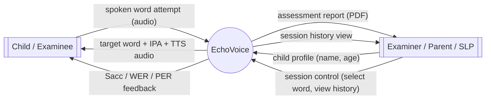
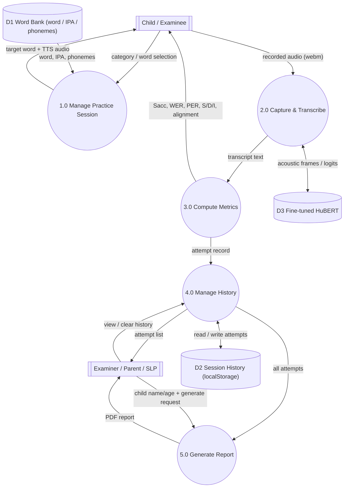
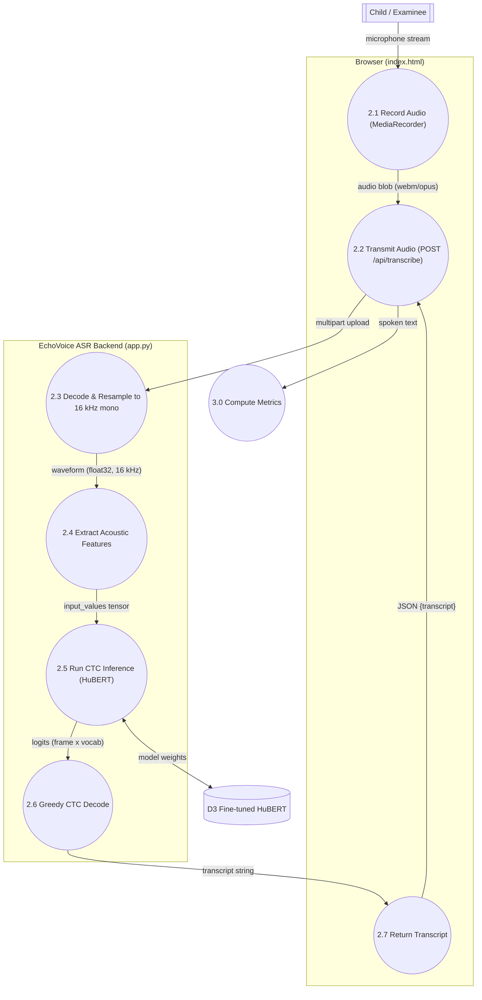

# Data Flow Diagrams (DFD) — EchoVoice

Gane–Sarson notation:

- **External entity** — a rectangle: `Child / Examinee`, `Examiner / Parent / SLP`
- **Process** — a rounded (stadium) shape, numbered `n.0`
- **Data store** — an open-ended bar, numbered `Dn`

The diagrams are **leveled** (balanced decomposition): Level 0 shows the whole
system as one process, Level 1 decomposes it into the app's main processes,
and Level 2 decomposes process 2.0 — the only process that crosses the network
to the EchoVoice ASR backend.

> **Phoneme notation.** Pronunciation is scored at the phoneme level, so the
> system needs a canonical phoneme symbol set. The lower-case symbols in the
> word bank (e.g. `k æ t` for "cat") are a simplified CMU-style **IPA subset**;
> they are the reference sequence `phonemes[]` used for PER/Sacc scoring. The
> `ipa` string (e.g. `/kæt/`) is the human-readable transcription shown on the
> word cards. Both come from `WORD_BANK` in `Source_Code/index.html`.

---

## Level 0 — Context Diagram

| # | Flow | From → To | Description |
|---|------|-----------|--------------|
| 1 | Spoken word attempt | Child → System | Raw audio captured by the browser microphone for one target word |
| 2 | Target word prompt | System → Child | Target word, IPA transcription, and TTS pronunciation |
| 3 | Live feedback | System → Child | Sacc, WER, PER, and phoneme alignment chips for the attempt just made |
| 4 | Child profile | Examiner → System | Name and age entered before/while testing, used on the report |
| 5 | Session control | Examiner → System | Word/category selection, tab navigation, "clear history" |
| 6 | Assessment report | System → Examiner | Downloadable PDF summarizing the session |
| 7 | Session history view | System → Examiner | On-screen list of all attempts in the current browser session |

---

## Level 1 — System Decomposition

| Process | Name | Summary |
|---------|------|---------|
| 1.0 | Manage Practice Session | Renders word categories/grid from D1, handles word selection, plays TTS |
| 2.0 | Capture & Transcribe Speech Attempt | Records audio in-browser, sends it to the EchoVoice ASR backend, gets back a transcript (decomposed in Level 2) |
| 3.0 | Compute Assessment Metrics | Converts transcript to phonemes, runs Levenshtein alignment, computes Sacc/WER/PER |
| 4.0 | Manage Session History | Persists and retrieves attempt records in the browser |
| 5.0 | Generate Assessment Report | Aggregates history into a formatted PDF via jsPDF |

**Data stores**

| Store | Contents | Physical implementation |
|-------|----------|--------------------------|
| D1 Word Bank | Static list of target words, IPA strings, phoneme arrays, grouped by category | JS object `WORD_BANK` embedded in `index.html` |
| D2 Session History | Every scored attempt in the current session | Browser `localStorage`, key `echovoice_history` |
| D3 Fine-tuned Model | HuBERT-Large weights fine-tuned on PERCEPT-GFTA (BCS) | Files under the `ECHOVOICE_MODEL_DIR` folder, loaded by `app.py` at startup |

The trust boundary sits between processes **1.0/3.0/4.0/5.0** (all run in the
browser) and **2.0**, whose inner steps cross the network to the EchoVoice ASR
backend — see Level 2.

---

## Level 2 — Decomposition of Process 2.0 (Capture & Transcribe)

| Process | Name | Where it runs | Implementation |
|---------|------|----------------|----------------|
| 2.1 | Record Audio | Browser | `navigator.mediaDevices.getUserMedia` + `MediaRecorder` capture the child's attempt |
| 2.2 | Transmit Audio | Browser → Backend | `transcribeWithBackend()` `fetch()`-POSTs the blob as multipart form data to `/api/transcribe` |
| 2.3 | Decode & Resample Audio | Backend | `_decode_audio()`: `soundfile`/`librosa` decode the container and resample to 16 kHz mono |
| 2.4 | Extract Acoustic Features | Backend | `AutoProcessor` normalizes the waveform into `input_values` |
| 2.5 | Run CTC Inference | Backend | Fine-tuned `AutoModelForCTC` (HuBERT) forward pass produces per-frame logits |
| 2.6 | Greedy CTC Decode | Backend | `argmax` over logits, then `processor.batch_decode` collapses repeats/blanks into text |
| 2.7 | Return Transcript | Backend → Browser | `handleRecordedAudio()` unpacks the JSON response and hands it to Process 3.0 |

This is the only network hop in the system; every other process (1.0, 3.0, 4.0,
5.0) executes entirely client-side in `index.html`.