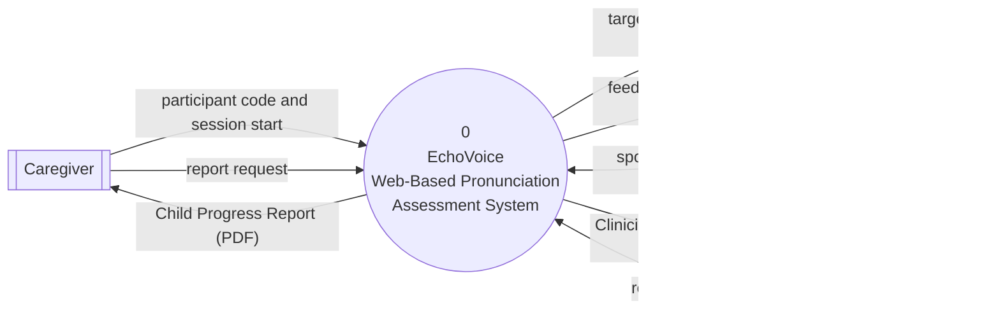
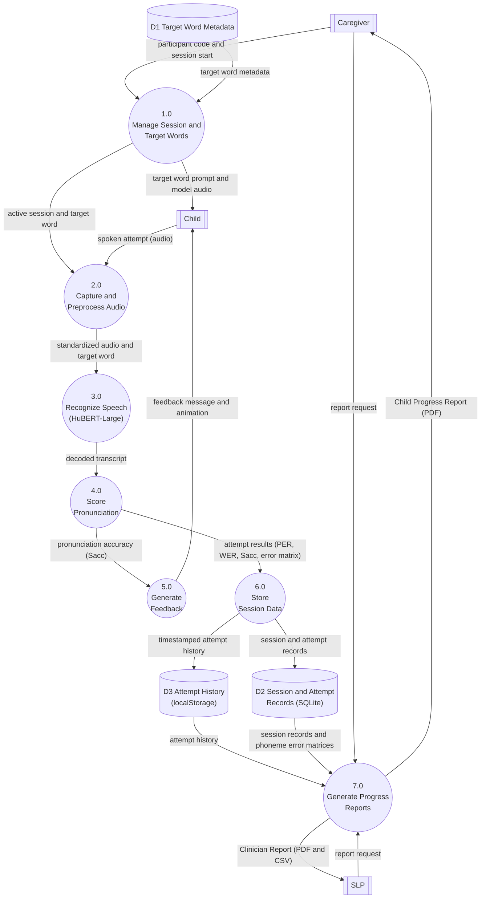
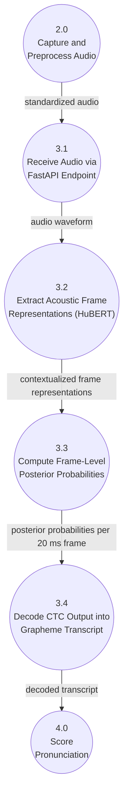

# Data Flow Diagrams (DFD) — EchoVoice

EchoVoice: A Web-Based Pronunciation Assessment for Speech Therapy.

This file follows the draft DFD in `DFD-1st-draft_drawio.pdf`. Notation: rectangles are external entities, circles are processes (numbered `n.0`), and open-ended shapes are data stores (`Dn`). Each level breaks down one process from the level above.

---

## Level 0 — Context Diagram

EchoVoice is shown as one process. It talks to three outside parties: the caregiver, the child (participant), and the cooperating SLP.

```mermaid
flowchart LR
    CG[["Caregiver"]]
    CH[["Child (Participant)"]]
    SLP[["Cooperating SLP"]]
    SYS(("0\nEchoVoice\nWeb-Based Pronunciation\nAssessment System"))

    CG -- "participant code and session start" --> SYS
    CG -- "report request" --> SYS
    SYS -- "Child Progress Report (PDF)" --> CG

    CH -- "spoken word attempt (audio)" --> SYS
    SYS -- "target word prompt and model audio" --> CH
    SYS -- "feedback message and animation" --> CH

    SLP -- "report request" --> SYS
    SYS -- "Clinician Report (PDF and CSV)" --> SLP
```

| # | Flow | From → To | Description |
|---|------|-----------|-------------|
| 1 | Participant code and session start | Caregiver → System | The caregiver enters the participant code (not the child's name) and starts the session |
| 2 | Spoken word attempt (audio) | Child → System | The child's recorded attempt at one target word |
| 3 | Target word prompt and model audio | System → Child | The word to say and a model pronunciation to listen to |
| 4 | Feedback message and animation | System → Child | An age-appropriate message and animation based on the score |
| 5 | Report request | Caregiver → System | Asks for the Child Progress Report |
| 6 | Child Progress Report (PDF) | System → Caregiver | Star ratings, streaks, and encouraging visuals. No technical numbers |
| 7 | Report request | SLP → System | Asks for the Clinician Report |
| 8 | Clinician Report (PDF and CSV) | System → SLP | Phoneme-level accuracy, error patterns, and session history |

---

## Level 1 — System Decomposition

Process 0 is broken into seven processes and three data stores.

```mermaid
flowchart TB
    CG[["Caregiver"]]
    CH[["Child"]]
    SLP[["SLP"]]

    P1(("1.0\nManage Session and\nTarget Words"))
    P2(("2.0\nCapture and\nPreprocess Audio"))
    P3(("3.0\nRecognize Speech\n(HuBERT-Large)"))
    P4(("4.0\nScore\nPronunciation"))
    P5(("5.0\nGenerate\nFeedback"))
    P6(("6.0\nStore\nSession Data"))
    P7(("7.0\nGenerate Progress\nReports"))

    D1[("D1  Target Word Metadata")]
    D2[("D2  Session and Attempt\nRecords (SQLite)")]
    D3[("D3  Attempt History\n(localStorage)")]

    CG -- "participant code and session start" --> P1
    D1 -- "target word metadata" --> P1
    P1 -- "target word prompt and model audio" --> CH
    P1 -- "active session and target word" --> P2

    CH -- "spoken attempt (audio)" --> P2
    P2 -- "standardized audio and target word" --> P3
    P3 -- "decoded transcript" --> P4
    P4 -- "pronunciation accuracy (Sacc)" --> P5
    P5 -- "feedback message and animation" --> CH

    P4 -- "attempt results (PER, WER, Sacc, error matrix)" --> P6
    P6 -- "timestamped attempt history" --> D3
    P6 -- "session and attempt records" --> D2

    D3 -- "attempt history" --> P7
    D2 -- "session records and phoneme error matrices" --> P7
    CG -- "report request" --> P7
    SLP -- "report request" --> P7
    P7 -- "Child Progress Report (PDF)" --> CG
    P7 -- "Clinician Report (PDF and CSV)" --> SLP
```

| Process | Name | Summary | Manuscript module |
|---------|------|---------|-------------------|
| 1.0 | Manage Session and Target Words | Starts a session from the participant code, reads word data from D1, and gives the child the target word and model audio | (session setup) |
| 2.0 | Capture and Preprocess Audio | Records the attempt with MediaRecorder and standardizes it: 16 kHz, mono, 16-bit PCM, peak-normalized to -1.0 dBFS, silence trimmed by VAD | Audio Capture Engine |
| 3.0 | Recognize Speech (HuBERT-Large) | Sends the audio to the FastAPI backend, which returns a transcript (see Level 2) | ASR backend |
| 4.0 | Score Pronunciation | Converts text to phonemes, aligns with Levenshtein, and computes PER, WER, Sacc, and the error matrix | Scoring Engine |
| 5.0 | Generate Feedback | Turns Sacc into a message and animation for the child | Feedback System |
| 6.0 | Store Session Data | Saves attempt results to D2 (SQLite) and the timestamped history to D3 (localStorage) | Persistence Layer |
| 7.0 | Generate Progress Reports | Builds the Child Progress Report (PDF) and the Clinician Report (PDF and CSV) | Progress Report Generator |

Data stores

| Store | Contents | Physical form |
|-------|----------|---------------|
| D1 Target Word Metadata | Target words, IPA, and phoneme sequences (GFTA-derived) | Word metadata managed by the FastAPI backend |
| D2 Session and Attempt Records | Sessions, attempts, scores, and phoneme error matrices | SQLite database behind the FastAPI backend |
| D3 Attempt History | Timestamped attempt history for each browser | Browser `localStorage` |

Note: the Level 1 flow directions for "attempt history" (D3 to 7.0) and "session records and phoneme error matrices" (D2 to 7.0) are read from the PDF labels. Please check them against your drawio file.

---

## Level 2 — Decomposition of Process 3.0 (Recognize Speech, HuBERT-Large)

```mermaid
flowchart TB
    P2(("2.0\nCapture and\nPreprocess Audio"))
    P4(("4.0\nScore\nPronunciation"))

    P31(("3.1\nReceive Audio via\nFastAPI Endpoint"))
    P32(("3.2\nExtract Acoustic Frame\nRepresentations (HuBERT)"))
    P33(("3.3\nCompute Frame-Level\nPosterior Probabilities"))
    P34(("3.4\nDecode CTC Output into\nGrapheme Transcript"))

    P2 -- "standardized audio" --> P31
    P31 -- "audio waveform" --> P32
    P32 -- "contextualized frame representations" --> P33
    P33 -- "posterior probabilities per 20 ms frame" --> P34
    P34 -- "decoded transcript" --> P4
```

| Process | Name | Summary |
|---------|------|---------|
| 3.1 | Receive Audio via FastAPI Endpoint | The backend accepts the standardized audio upload and loads the waveform |
| 3.2 | Extract Acoustic Frame Representations (HuBERT) | A CNN encoder and a 24-layer transformer turn the waveform into one representation per 20 ms frame |
| 3.3 | Compute Frame-Level Posterior Probabilities | A linear layer gives, for each 20 ms frame, the probability of each grapheme token |
| 3.4 | Decode CTC Output into Grapheme Transcript | CTC decoding collapses repeats and blanks into the transcript text |

The transcript is made of graphemes. Grapheme-to-phoneme conversion happens later, inside process 4.0.
