# Structured Chart — EchoVoice

Yourdon/Constantine-style structure chart. Arrows show *control* (which module
calls which); small annotated labels on the arrows show what's passed:
**(d)** = data couple, **(c)** = control couple (a flag/status, e.g. success/error).
Module names are the **actual function names in `index.html` / `app.py`**, so
the chart double-checks against the code.

```mermaid
flowchart TB
    MAIN(["EchoVoice Main Controller"])

    MAIN --> PRAC["Practice Session<br/>renderCategories · renderWordGrid · selectWord · speakWord"]
    MAIN --> REC["Recording Controller<br/>startRecording · stopRecording · handleRecordedAudio · transcribeWithBackend"]
    MAIN --> ASM["Assessment Engine<br/>analyzeAttempt"]
    MAIN --> HIST["History Manager<br/>renderHistory · clear history"]
    MAIN --> REP["Report Generator<br/>updateReportSummary · generatePDF"]

    PRAC --> P1["renderCategories (d: category)"]
    PRAC --> P2["renderWordGrid (d: WORD_BANK)"]
    PRAC --> P3["selectWord (d: word object)"]
    PRAC --> P4["speakWord (d: word text)"]

    REC --> R1["startRecording (c: mic granted?)"]
    REC --> R2["stopRecording"]
    REC --> R3["transcribeWithBackend<br/>POST /api/transcribe (d: audio blob)"]
    R3 --> R4["handleRecordedAudio (d: transcript / c: error)"]

    ASM --> A1["wordToPhonemes (d: spoken text)"]
    ASM --> A2["computeWER (d: target, spoken)"]
    ASM --> A3["computePER (d: ref phonemes, hyp phonemes)"]
    A2 --> L1["levenshteinAlign (word-level)"]
    A3 --> L2["levenshteinAlign (phoneme-level)"]
    ASM --> A4["Sacc = max(0, (Np−(Sp+Dp+Ip))/Np)×100"]
    ASM --> A5["render phoneme alignment chips (d: alignment[])"]

    HIST --> H1["save attempt (d: attempt record → localStorage echovoice_history)"]
    HIST --> H2["renderHistory (d: history[])"]
    HIST --> H3["clear history (c: confirm)"]

    REP --> G1["updateReportSummary (d: history[])"]
    REP --> G2["generatePDF (jsPDF + autotable)"]

    R3 -. "network call" .-> BACKEND[["app.py — FastAPI backend<br/>transcribe · _decode_audio · _load_model"]]
```

## Reading the chart

| Level | Module | Code location | Called by | Passes down (d) | Passes up (d/c) |
|-------|--------|---------------|-----------|-------------------|-------------------|
| 0 | EchoVoice Main Controller | `index.html` (event handlers, init) | — (entry point / tab router) | — | — |
| 1 | Practice Session | `renderCategories`, `renderWordGrid`, `selectWord`, `speakWord` | Main | selected category | selected word object |
| 1 | Recording Controller | `startRecording`, `stopRecording`, `handleRecordedAudio`, `transcribeWithBackend` | Main | audio blob | transcript text **or** error flag |
| 1 | Assessment Engine | `analyzeAttempt` (+ `wordToPhonemes`, `computeWER`, `computePER`, `levenshteinAlign`) | Main via `handleRecordedAudio` | target word, target phonemes, spoken text | metrics object `{Sacc, WER, PER, S, D, I, alignment[]}` |
| 1 | History Manager | `renderHistory`, clear-history listener | Main / Assessment Engine | attempt record | history array |
| 1 | Report Generator | `updateReportSummary`, `generatePDF` | Main (Report tab) | history array, child name/age | PDF file (side effect: download) |
| 2 | Send Audio to Backend | `transcribeWithBackend` | Recording Controller | audio blob | transcript (d) / network error (c) |
| 2 | WER / PER | `computeWER`, `computePER` | Assessment Engine | ref/hyp sequences | error rates + S/D/I counts |

**Module coupling notes**

- `Recording Controller` is the only module with *external* coupling — it is
  the sole caller across the network boundary to the FastAPI backend (`app.py`),
  via `POST /api/transcribe` (see `01_DFD.md`, Level 2). All other modules run
  within the browser process.
- `Assessment Engine` is purely functional: given target + spoken text it
  always returns the same metrics (`analyzeAttempt` never touches storage or
  the network), which keeps it easy to unit test.
- Control couples (c) are kept to booleans/status flags only (mic permission
  granted, backend reachable, confirm-clear-history) — no module reaches back
  up to alter its caller's internal state, preserving top-down control flow.