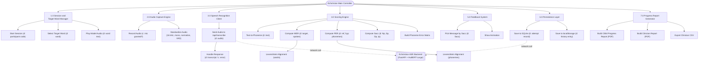

# Structured Chart — EchoVoice

Yourdon/Constantine-style structure chart, updated to the seven processes in `01_DFD.md` and the five modules in the manuscript. Arrows show which module calls which. **(d)** means data passed, **(c)** means a status flag.

```mermaid
flowchart TB
    MAIN(["EchoVoice Main Controller"])

    MAIN --> SES["1.0 Session and\nTarget Word Manager"]
    MAIN --> CAP["2.0 Audio Capture Engine"]
    MAIN --> ASR["3.0 Speech Recognition Client"]
    MAIN --> SCO["4.0 Scoring Engine"]
    MAIN --> FEE["5.0 Feedback System"]
    MAIN --> PER["6.0 Persistence Layer"]
    MAIN --> REP["7.0 Progress Report Generator"]

    SES --> S1["Start Session (d: participant code)"]
    SES --> S2["Select Target Word (d: word)"]
    SES --> S3["Play Model Audio (d: word text)"]

    CAP --> C1["Record Audio (c: mic granted?)"]
    CAP --> C2["Standardize Audio\n(16 kHz, mono, normalize, VAD)"]

    ASR --> R1["Send Audio to /api/transcribe\n(d: audio)"]
    R1 --> R2["Handle Response\n(d: transcript / c: error)"]

    SCO --> A1["Text-to-Phoneme (d: text)"]
    SCO --> A2["Compute WER (d: target, spoken)"]
    SCO --> A3["Compute PER (d: ref, hyp phonemes)"]
    A2 --> A2a["Levenshtein Alignment (words)"]
    A3 --> A3a["Levenshtein Alignment (phonemes)"]
    SCO --> A4["Compute Sacc (d: Np, Sp, Dp, Ip)"]
    SCO --> A5["Build Phoneme Error Matrix"]

    FEE --> F1["Pick Message by Sacc (d: Sacc)"]
    FEE --> F2["Show Animation"]

    PER --> P1["Save to SQLite (d: attempt record)"]
    PER --> P2["Save to localStorage (d: history entry)"]

    REP --> G1["Build Child Progress Report (PDF)"]
    REP --> G2["Build Clinician Report (PDF)"]
    REP --> G3["Export Clinician CSV"]

    R1 -. "network call" .-> BACKEND[["EchoVoice ASR Backend\n(FastAPI + HuBERT-Large)"]]
    P1 -. "network call" .-> BACKEND
```

## Reading the chart

| Module | Called by | Passes down | Passes up |
|---|---|---|---|
| Session and Target Word Manager | Main | participant code, category | active session and target word |
| Audio Capture Engine | Main | target word | standardized audio, or error flag |
| Speech Recognition Client | Main | standardized audio | transcript, or error flag |
| Scoring Engine | Main | transcript, target word, target phonemes | PER, WER, Sacc, Sp, Dp, Ip, error matrix |
| Feedback System | Main | Sacc | message and animation |
| Persistence Layer | Main | attempt results | saved-OK flag |
| Progress Report Generator | Main | report request, saved records | PDF or CSV file |

## Notes

- The Speech Recognition Client and the Persistence Layer are the modules that talk to the backend over the network. The rest run in the browser.
- The Scoring Engine only calculates. Given the same transcript and target, it always returns the same scores, so it is easy to test alone.
- The Child Progress Report must not include technical metrics or phoneme error matrices. Only the Clinician Report does.
