# HIPO Diagram — EchoVoice
### (Hierarchy plus Input-Process-Output)

Module names match the **actual function names** in `index.html` / `app.py`.

## 1. Visual Table of Contents (VTOC)

```mermaid
flowchart TB
    M0["0.0 EchoVoice System (index.html)"]
    M0 --> M1["1.0 Practice Session (renderCategories, renderWordGrid, selectWord, speakWord)"]
    M0 --> M2["2.0 Capture & Transcribe (startRecording, stopRecording, handleRecordedAudio, transcribeWithBackend)"]
    M0 --> M3["3.0 Assessment Engine (analyzeAttempt)"]
    M0 --> M4["4.0 History Manager (renderHistory, clear history)"]
    M0 --> M5["5.0 Report Generator (updateReportSummary, generatePDF)"]

    M1 --> M1a["1.1 renderCategories"]
    M1 --> M1b["1.2 renderWordGrid"]
    M1 --> M1c["1.3 selectWord"]
    M1 --> M1d["1.4 speakWord"]

    M2 --> M2a["2.1 startRecording"]
    M2 --> M2b["2.2 stopRecording"]
    M2 --> M2c["2.3 transcribeWithBackend"]
    M2 --> M2d["2.4 handleRecordedAudio"]

    M3 --> M3a["3.1 wordToPhonemes"]
    M3 --> M3b["3.2 computeWER"]
    M3 --> M3c["3.3 computePER"]
    M3 --> M3d["3.4 compute Sacc + render chips"]

    M4 --> M4a["4.1 renderHistory"]
    M4 --> M4b["4.2 clear history"]

    M5 --> M5a["5.1 updateReportSummary"]
    M5 --> M5b["5.2 generatePDF"]
```

## 2. IPO Charts

### 2.0 Capture & Transcribe Speech Attempt

| | |
|---|---|
| **Input** | Microphone audio stream (child's spoken attempt) |
| **Process** | 1. `startRecording`: request mic permission and start `MediaRecorder`. 2. `stopRecording`: assemble recorded chunks into a Blob. 3. If Blob is too small (< 500 bytes) → treat as silence, prompt retry. 4. `transcribeWithBackend`: POST Blob as multipart form data to `/api/transcribe`. 5. `handleRecordedAudio`: on success, pass the transcript to module 3.0; on network/HTTP error, show the backend-offline banner and a toast. |
| **Output** | `spokenText` (lowercase transcript string) passed to module 3.0, **or** an error/toast if the backend could not be reached |

### 3.0 Compute Assessment Metrics

| | |
|---|---|
| **Input** | `targetWord`, `targetPhonemes[]` (from Word Bank), `spokenText` (from module 2.0) |
| **Process** | 1. `wordToPhonemes(spokenText)` → spoken phonemes. 2. `computeWER`: word-level Levenshtein alignment → WER, substitutions/deletions/insertions at word level. 3. `computePER`: phoneme-level Levenshtein alignment → PER, `Sp`/`Dp`/`Ip`. 4. `Sacc = max(0, (Np − (Sp+Dp+Ip)) / Np) × 100`. 5. Render the per-phoneme alignment chips (correct / substitution / deletion / insertion). 6. Build the attempt record and save it to history (module 4.0). |
| **Output** | Metrics object `{Sacc, WER, PER, Sp, Dp, Ip, alignment[]}` rendered to the Result Panel and appended to module 4.0 as a history entry |

### 4.0 Manage Session History

| | |
|---|---|
| **Input** | Attempt record from module 3.0; user actions (view history tab, clear history) |
| **Process** | 1. Push new attempt onto in-memory `sessionHistory` array. 2. Serialize and persist to `localStorage['echovoice_history']`. 3. `renderHistory`: on the History tab, read and render all entries newest-first. 4. On "Clear All", confirm then wipe both the array and the `localStorage` key. |
| **Output** | Updated on-screen history list; persisted history available to module 5.0 |

### 5.0 Generate Assessment Report

| | |
|---|---|
| **Input** | `sessionHistory[]`, child name/age, session date |
| **Process** | 1. `updateReportSummary`: compute totals, averages (avgWER, avgPER, avgAcc), and best word. 2. `generatePDF`: group attempts by target word; compute per-word average accuracy/WER/PER and S/D/I totals. 3. Lay out the PDF (header, summary boxes, per-word table via `jspdf-autotable`, detailed attempt log, interpretation notes, ICC reference scale, footer). 4. Trigger a browser download named `EchoVoice_Report_<child>_<date>.pdf`. |
| **Output** | Downloaded PDF assessment report |

### 1.0 Manage Practice Session

| | |
|---|---|
| **Input** | Category click, word-card click, "Listen First"/speaker-icon click |
| **Process** | `renderCategories`: build category buttons. `renderWordGrid`: filter `WORD_BANK` by selected category and render word cards (marking ones already tested). `selectWord`: populate the active-word panel. `speakWord`: call `speechSynthesis` to pronounce the word. |
| **Output** | `selectedWord` (word/IPA/phonemes) available to modules 2.0 and 3.0 |