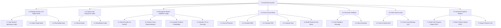

# HIPO Diagram — EchoVoice
### (Hierarchy plus Input-Process-Output)

The numbering now matches the seven processes in `01_DFD.md`. The manuscript names five modules; each one is tied to a process number below.

| Manuscript module | HIPO module |
|---|---|
| Audio Capture Engine | 2.0 |
| Scoring Engine | 4.0 |
| Feedback System | 5.0 |
| Persistence Layer | 6.0 |
| Progress Report Generator | 7.0 |

## 1. Visual Table of Contents (VTOC)

```mermaid
flowchart TB
    M0["0.0 EchoVoice System"]
    M0 --> M1["1.0 Manage Session and Target Words"]
    M0 --> M2["2.0 Capture and Preprocess Audio"]
    M0 --> M3["3.0 Recognize Speech (HuBERT-Large)"]
    M0 --> M4["4.0 Score Pronunciation"]
    M0 --> M5["5.0 Generate Feedback"]
    M0 --> M6["6.0 Store Session Data"]
    M0 --> M7["7.0 Generate Progress Reports"]

    M1 --> M1a["1.1 Start Session (participant code)"]
    M1 --> M1b["1.2 Select Target Word"]
    M1 --> M1c["1.3 Play Model Audio"]

    M2 --> M2a["2.1 Record Audio"]
    M2 --> M2b["2.2 Standardize Audio"]

    M3 --> M3a["3.1 Receive Audio via FastAPI"]
    M3 --> M3b["3.2 Extract Frame Representations"]
    M3 --> M3c["3.3 Compute Posterior Probabilities"]
    M3 --> M3d["3.4 Decode CTC to Transcript"]

    M4 --> M4a["4.1 Text-to-Phoneme"]
    M4 --> M4b["4.2 Compute WER"]
    M4 --> M4c["4.3 Compute PER"]
    M4 --> M4d["4.4 Compute Sacc"]
    M4 --> M4e["4.5 Build Phoneme Error Matrix"]

    M5 --> M5a["5.1 Pick Feedback Message"]
    M5 --> M5b["5.2 Show Animation"]

    M6 --> M6a["6.1 Save to SQLite (D2)"]
    M6 --> M6b["6.2 Save to localStorage (D3)"]

    M7 --> M7a["7.1 Build Child Progress Report (PDF)"]
    M7 --> M7b["7.2 Build Clinician Report (PDF)"]
    M7 --> M7c["7.3 Export Clinician CSV"]
```

## 2. IPO Charts

### 1.0 Manage Session and Target Words

| | |
|---|---|
| **Input** | Participant code, session start, word selection, "listen" request, word data from D1 |
| **Process** | Start a session tied to the participant code. Load the target word, IPA, and phonemes from D1. Play the model audio when asked. |
| **Output** | Active session and target word (to 2.0), target word prompt and model audio (to the child) |

### 2.0 Capture and Preprocess Audio

| | |
|---|---|
| **Input** | Child's microphone audio, active target word |
| **Process** | 1. Ask for microphone permission and start `MediaRecorder`. 2. When recording stops, put the chunks into one audio file. 3. If the file is too small, treat it as silence and ask the child to try again. 4. Standardize the audio: 16 kHz, mono, 16-bit PCM. 5. Peak-normalize to -1.0 dBFS. 6. Trim silence at the start and end with the voice activity detector (VAD). |
| **Output** | Standardized audio and target word (to 3.0), or an error message if recording failed |

### 3.0 Recognize Speech (HuBERT-Large)

| | |
|---|---|
| **Input** | Standardized audio |
| **Process** | 1. Receive the audio at the FastAPI endpoint. 2. Turn the waveform into one representation per 20 ms frame. 3. Compute the probability of each grapheme token for every frame. 4. Decode the CTC output into a grapheme transcript. |
| **Output** | Decoded transcript (to 4.0), or an error if the backend cannot be reached |

### 4.0 Score Pronunciation

| | |
|---|---|
| **Input** | Decoded transcript, target word and target phonemes |
| **Process** | 1. Convert the transcript to phonemes. 2. Align words with Levenshtein to get WER. 3. Align phonemes with Levenshtein to get PER and the counts Sp, Dp, Ip. 4. Compute Sacc = max(0, (Np − (Sp + Dp + Ip)) / Np) × 100. 5. Build the phoneme error matrix from the alignment. |
| **Output** | Sacc (to 5.0). PER, WER, Sacc, and error matrix (to 6.0) |

### 5.0 Generate Feedback

| | |
|---|---|
| **Input** | Sacc |
| **Process** | Choose a message by score. 90 to 100 gives "Very Good!" with a star animation. Below 30 gives "Let's Practice Together!" with a replay prompt. Scores in between get an encouraging message. |
| **Output** | Feedback message and animation (to the child) |

### 6.0 Store Session Data

| | |
|---|---|
| **Input** | Attempt results (PER, WER, Sacc, error matrix) |
| **Process** | Save the session and attempt records to SQLite (D2). Save the timestamped attempt history to localStorage (D3). |
| **Output** | Saved records in D2 and D3 |

### 7.0 Generate Progress Reports

| | |
|---|---|
| **Input** | Report request from the caregiver or the SLP, attempt history (D3), session records and phoneme error matrices (D2) |
| **Process** | For the caregiver: build the Child Progress Report with star ratings, streaks, and badges, and no technical numbers. For the SLP: build the Clinician Report with phoneme error matrices, error-pattern trends, and session metrics, plus a CSV export. Show only the anonymized session identifier in both. |
| **Output** | Child Progress Report (PDF), Clinician Report (PDF and CSV) |
