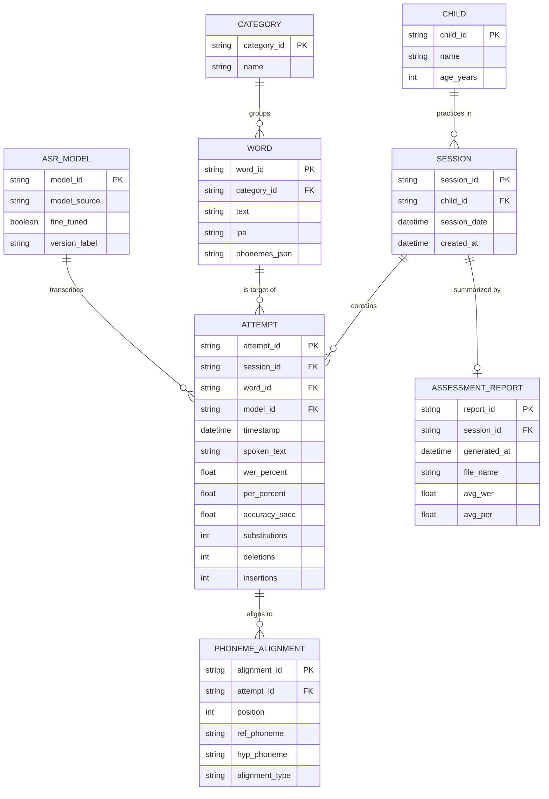

# Entity Relationship Diagram (ERD) — EchoVoice

The running app persists data only in the browser (`localStorage`), not in a
relational database — see `07_data_dictionary.md` for the exact physical JSON
shapes. This ERD is the **logical** data model those JSON structures
implement, and the model a future multi-device/clinician-facing backend
(with a real database) would use. It normalizes the current flat attempt
records into proper entities.

## Cardinality notes

| Relationship | Cardinality | Meaning |
|---|---|---|
| CATEGORY → WORD | 1 to many | Each word belongs to exactly one practice category (e.g. "Animals") |
| CHILD → SESSION | 1 to many | A child can have multiple practice sessions over time |
| SESSION → ATTEMPT | 1 to many | Each attempt (one recorded word) belongs to exactly one session |
| WORD → ATTEMPT | 1 to many | The same target word can be attempted multiple times, in the same or different sessions |
| ASR_MODEL → ATTEMPT | 1 to many | Every attempt records which model/checkpoint produced its transcript, for reproducibility/versioning |
| ATTEMPT → PHONEME_ALIGNMENT | 1 to many | The phoneme-by-phoneme alignment (correct/substitution/deletion/insertion) for one attempt |
| SESSION → ASSESSMENT_REPORT | 1 to 0-or-1 | A report is generated on demand from a session's attempts; a session may have no report yet |

## Why ASR_MODEL is modeled explicitly

Because EchoVoice's scoring depends on which model produced the transcript
(the fine-tuned child-speech HuBERT vs. the base fallback — see
`Source_Code/app.py`), each `ATTEMPT` is tied to a specific `ASR_MODEL` record.
This keeps historical scores interpretable if the model is later retrained or
the backend temporarily falls back to the base checkpoint.
