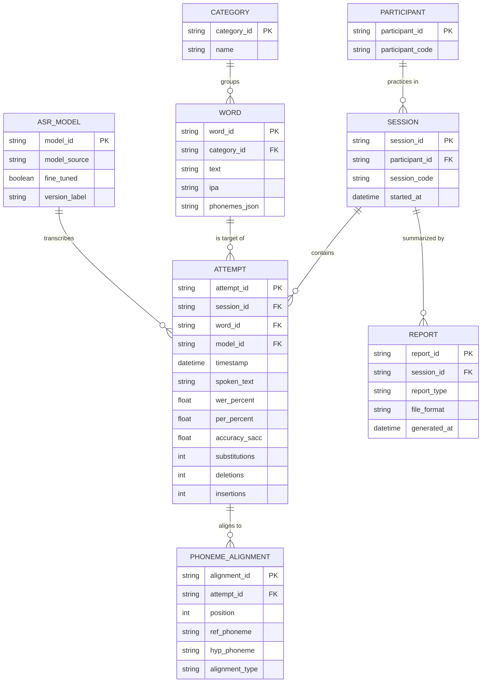

# Entity Relationship Diagram (ERD) — EchoVoice

This ERD follows the manuscript and `01_DFD.md`. Session and attempt records are kept in SQLite (D2), and the browser keeps a timestamped copy of the attempt history in `localStorage` (D3). Children are identified only by a participant code, so no names are stored. Reports show only the anonymized session identifier.

```mermaid
erDiagram
    CATEGORY ||--o{ WORD : "groups"
    PARTICIPANT ||--o{ SESSION : "practices in"
    SESSION ||--o{ ATTEMPT : "contains"
    WORD ||--o{ ATTEMPT : "is target of"
    ASR_MODEL ||--o{ ATTEMPT : "transcribes"
    ATTEMPT ||--o{ PHONEME_ALIGNMENT : "aligns to"
    SESSION ||--o{ REPORT : "summarized by"

    CATEGORY {
        string category_id PK
        string name
    }

    WORD {
        string word_id PK
        string category_id FK
        string text
        string ipa
        string phonemes_json
    }

    PARTICIPANT {
        string participant_id PK
        string participant_code
    }

    SESSION {
        string session_id PK
        string participant_id FK
        string session_code
        datetime started_at
    }

    ASR_MODEL {
        string model_id PK
        string model_source
        boolean fine_tuned
        string version_label
    }

    ATTEMPT {
        string attempt_id PK
        string session_id FK
        string word_id FK
        string model_id FK
        datetime timestamp
        string spoken_text
        float  wer_percent
        float  per_percent
        float  accuracy_sacc
        int    substitutions
        int    deletions
        int    insertions
    }

    PHONEME_ALIGNMENT {
        string alignment_id PK
        string attempt_id FK
        int    position
        string ref_phoneme
        string hyp_phoneme
        string alignment_type
    }

    REPORT {
        string report_id PK
        string session_id FK
        string report_type
        string file_format
        datetime generated_at
    }
```

## Cardinality notes

| Relationship | Cardinality | Meaning |
|---|---|---|
| CATEGORY to WORD | 1 to many | Each word belongs to one category |
| PARTICIPANT to SESSION | 1 to many | A child can have many sessions over time |
| SESSION to ATTEMPT | 1 to many | Each recorded attempt belongs to one session. The pilot plan is 20 GFTA-derived words per child |
| WORD to ATTEMPT | 1 to many | The same word can be tried many times |
| ASR_MODEL to ATTEMPT | 1 to many | Each attempt records which model produced its transcript |
| ATTEMPT to PHONEME_ALIGNMENT | 1 to many | The phoneme-by-phoneme alignment for one attempt |
| SESSION to REPORT | 1 to many | A session can produce a Child Progress Report (PDF), a Clinician Report (PDF), and a Clinician CSV |

## Notes

- The phoneme error matrix in the Clinician Report is not its own table. It is built by counting the PHONEME_ALIGNMENT rows of type substitution, deletion, and insertion.
- `report_type` is `child` or `clinician`. `file_format` is `pdf` or `csv`.
- ASR_MODEL stays in the model so old scores can still be understood if the model is retrained.
