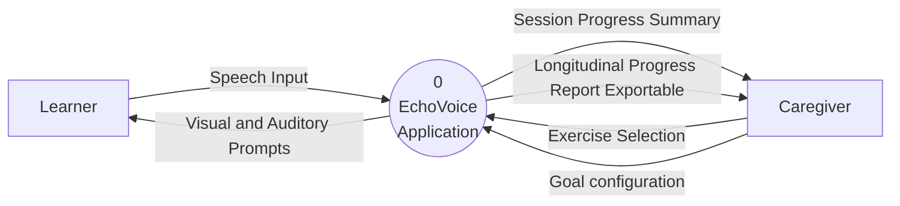
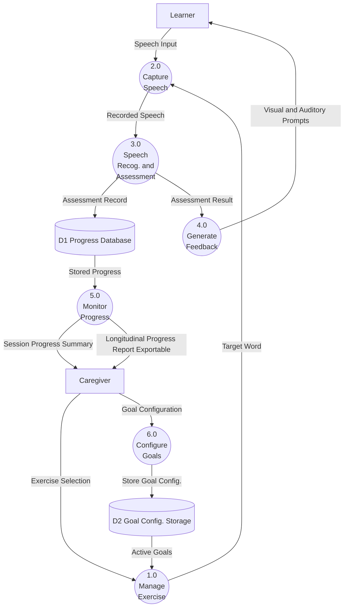
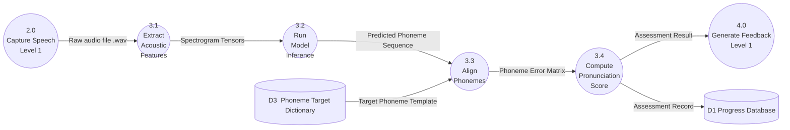
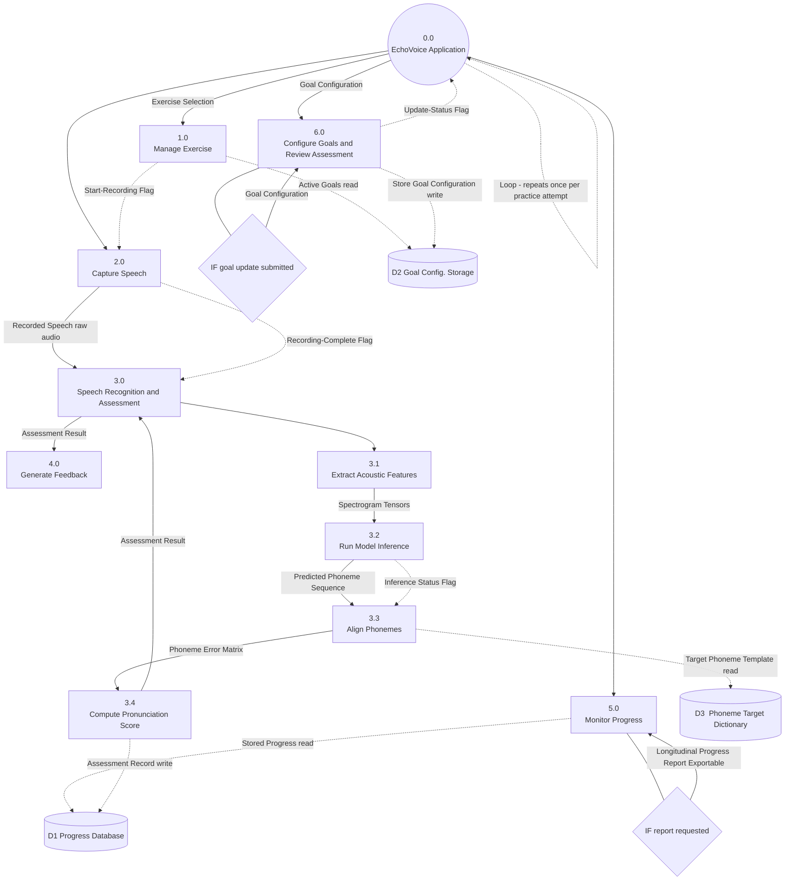
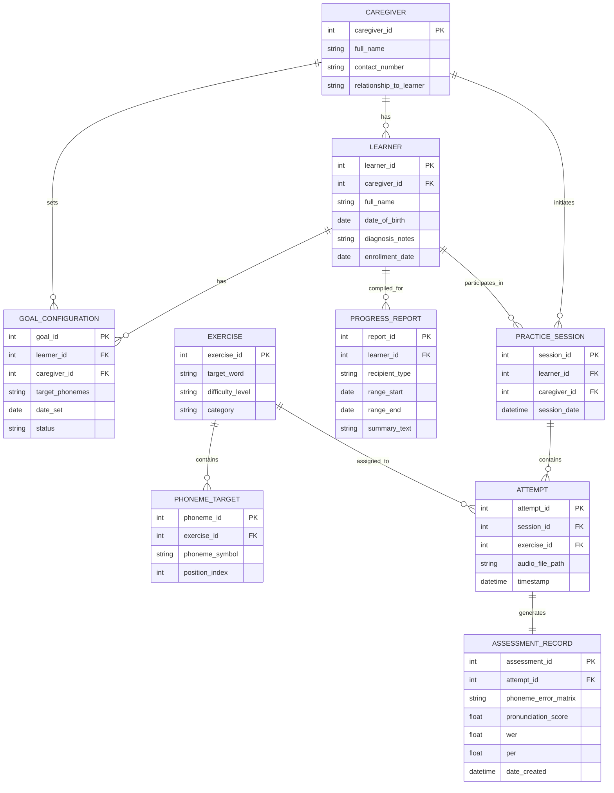
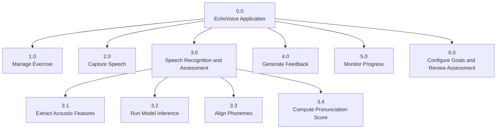

# EchoVoice — Documentation Package (Markdown + Diagram Source)

This package contains every EchoVoice design document as plain Markdown, and every diagram (DFD Level 0–2, Structure Chart, ERD, HIPO Hierarchy Chart) as editable **Mermaid** source code. Paste any `.mmd` file's contents into a Mermaid-compatible renderer (the Mermaid Live Editor at mermaid.live, GitHub/GitLab markdown, Notion, Obsidian, VS Code's Mermaid preview extension, etc.) to regenerate the diagram — and to edit it, just edit the text.

## Contents

### Diagrams (Mermaid source, `.mmd`)
| File | Diagram |
|---|---|
| `DFD_Level0.mmd` | Data Flow Diagram — Level 0 (context diagram) |
| `DFD_Level1.mmd` | Data Flow Diagram — Level 1 |
| `DFD_Level2.mmd` | Data Flow Diagram — Level 2 (decomposition of Process 3.0) |
| `StructureChart.mmd` | Structure Chart (modules, data/control flow, conditions, loop) |
| `ERD.mmd` | Entity Relationship Diagram |
| `HIPO_Hierarchy.mmd` | HIPO Hierarchy Chart (VTOC) |

### Documents (Markdown, `.md`)
| File | Source document |
|---|---|
| `Chapter1_2.md` | Chapter 1 & 2 (Introduction, Situational Analysis, etc.) |
| `Diagrams_Explained.md` | Explanation and step-by-step flow for every diagram/chart |
| `EchoVoice_HIPO.md` | HIPO IPO Charts |
| `EchoVoice_Data_Dictionary.md` | Data Dictionary |
| `EchoVoice_Pseudocode.md` | Pseudocode |
| `EchoVoice_StructuredEnglish.md` | Structured English |

---

## Consistency

All documents are aligned to a single actor model: at Level 0 the system has exactly two external entities — the **Learner** and the **Caregiver**.

- The **Caregiver** supplies Exercise Selection, Goal Configuration, and the Report-Request Flag, and receives the Session Progress Summary, the Exportable Longitudinal Progress Report, and the Update-Status Flag.
- The **Speech-Language Pathologist (SLP)** is an **external** clinical validator, **not** a user of the application. EchoVoice runs fully offline with no account or server; the Caregiver exports the progress report and shares it with an external clinician through their own preferred channels (matching Chapter 1 & 2).
- The Pseudocode, Structured English, HIPO, Data Dictionary, and ERD below all reflect this model consistently. There is no SLP entity or SLP data flow in any diagram.

---

## Diagram previews

*Each preview below is explained and walked through step-by-step in [`Diagrams_Explained.md`](Diagrams_Explained.md).*

### DFD Level 0
*Context diagram: the app (process 0) sits between the Learner (Speech Input in; Visual & Auditory Prompts out) and the Caregiver (Exercise Selection and Goal configuration in; Session Progress Summary and the Exportable Longitudinal Progress Report out). The SLP is external.*

### DFD Level 1
*The six processes (1.0–6.0), the D1 Progress Database and D2 Goal Config Store, and all Learner/Caregiver data flows.*

### DFD Level 2 (decomposition of 3.0)
*Internal pipeline of Process 3.0 (3.1 → 3.2 → 3.3 → 3.4), reading D3 Phoneme Target Dictionary and writing the Assessment Record to D1.*

### Structure Chart
*Module tree 0.0 → 1.0–6.0 (with 3.0 → 3.1–3.4) showing data flow, control flags (Start-Recording, Recording-Complete, Inference Status, Update-Status, Report-Request), the IF conditions, the session loop, and D1/D2/D3 access.*

### ERD
*Nine entities in Crow's Foot notation, the caregiver-centric business rules, and the strict 1:1 Attempt → Assessment_Record; there is no SLP entity.*

### HIPO Hierarchy Chart
*Top-down module tree (VTOC) matching the Structure Chart; the Input–Process–Output tables for each module are in `EchoVoice_HIPO.md`.*

